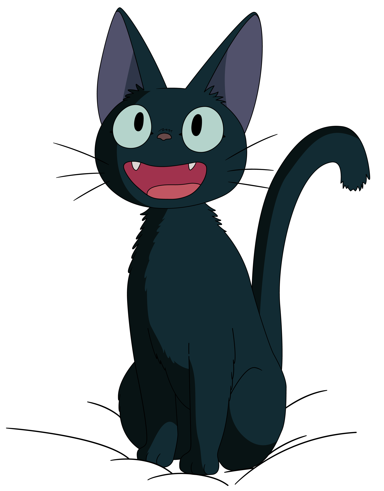

---

  <h1> Hi, I'm Mélanie !</h1>

  
   
   
  

  

- 🌱 Interested in web development
- 📗 Currently learning with O'Clock

---

### ⚙️ 🛠️ Languages and tools :
   

---

### 📊 GitHub Stats :
 

---
